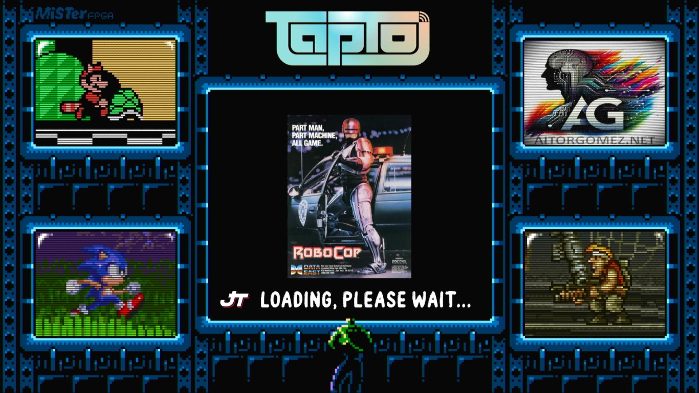

# Main_MiSTer Main Binary and Wiki Repo

This repo serves as the home for the MiSTer Main binaries and the Wiki.

For the purposes of getting google to crawl the wiki, here's a link to the (not for humans) [crawlable wiki](https://github-wiki-see.page/m/MiSTer-devel/Wiki_MiSTer/wiki)

If you're a human looking for the wiki, that's [here](https://github.com/MiSTer-devel/Wiki_MiSTer/wiki)

# aitorgomez fork

This *fork* of the original **MiSTer** project includes a number of features aimed at integrating with the [TapTo](https://github.com/wizzomafizzo/tapto) project by [wizzo](https://wizzo.dev/), as well as others related to displaying a screen while loading games. Both features are optional, however, as of today, they have not been approved for the [original repository](https://github.com/MiSTer-devel/Main_MiSTer), which is, of course, understandable and respectable.

The reasons behind a repository owner's decision not to approve certain changes can vary widely, but often include concerns related to maintenance, consistency with the project's goals, compatibility with existing features, or a preference for a different direction in the project's development. Additionally, introducing new features can sometimes introduce new dependencies or complexities that may not align with the original vision or may require more extensive testing to ensure stability across different environments. In such cases, while the contributions are valued, the decision to keep the project streamlined and focused on its core objectives takes precedence.

The idea was born as an addition to the magnificent [TapTo](https://github.com/wizzomafizzo/tapto) project, and it involves additional features that I have been very clear about since I discovered this project, especially in terms of using **MiSTer** as a gaming center and with the goal of making it user-friendly for anyone, regardless of their technical knowledge. In this regard, the contribution of [TapTo](https://github.com/wizzomafizzo/tapto) is crucial.


*Wallpaper seen on the [misterfpga forum](https://misterfpga.org/viewtopic.php?t=118&start=150#p64069), original design by [Dinierto Designs](https://x.com/DiniertoDesigns).*

While these modifications have been primarily developed for my own use, I've chosen to share them with the community. Currently, I'm in the process of automating the synchronization task with the original repository's releases through a **Docker** system on my **NAS**. Until this automation is fully operational, I will endeavor to manually update and maintain the fork as current as possible. If this project resonates with you and you'd like to show your support, feel welcome to visit my [ko-fi](https://ko-fi.com/spark2k06) page.

## Loading Screen

This feature allows for the customization of loading **ROMs** and games from most systems.



To make use of it, you should follow the instructions below:

**loader.png** in root directory with **1920x1080** pixels for the loading screen background.

**loading.png** in root directory with alpha channel and **448x64** pixels for the game loading text, I leave a default one in the repository. The absence of this file causes the original loading status message to appear.

To make use of the covers, a folder called **covers** must be created in the root directory. In this folder, the folders corresponding to the system must be created and from here the **.png** files must be placed with the same name as the **ROM**, with alpha channel and size **256x320** pixels. Example:

```
covers/
├── Arcade/
│   ├── Bubble Bobble (Japan, Ver 0.1).png
│   └── Robocop (World revision 4).png
├── MegaDrive/
│   └── Sonic The Hedgehog (USA, Europe).png
├── PCXT/
│   └── AlleyCat.png
└── ao486/
    └── Wolf3D.png
```

Note that arcade **ROM** covers are located in the **Arcade** subfolder. By default this will be the directory for this type of covers, however, if the **cfgarcade_subfolder** entry in **MiSTer.ini** is set, the name of that entry will be the one used:

```ini
[MiSTer]
cfgarcade_subfolder="MyArcades"
```

By default, the position of loading text is at the bottom. It can be adjusted at the top with:

```ini
[MiSTer]
loading_txt_up=1
```

## TapTo support

This feature allows the use of the [TapTo](https://github.com/wizzomafizzo/tapto) system by [wizzo](https://wizzo.dev/). It offers the following features, using the **TapTo API** service:

* Detection of **ACR122U** and **PN532** readers in the menu.
* Standby screen.


To make use of it, you should follow the instructions below:

**tapto_1.png** and **tapto_2.png** in root directory with alpha channel and **512x384** pixels for the standby screen, I leave both as default in this repository.

**waiting.png** with alpha channel and **512x64** pixels for the standby waiting text, I leave one as default in this repository.

By default, the position of waiting text is at the bottom. It can be adjusted at the top with:

```ini
[MiSTer]
waiting_txt_up=1
```

## New MGL tags

In order to facilitate the integration of both features in cores where interaction with disk images is required, the functionality of the [MGL](https://mister-devel.github.io/MkDocs_MiSTer/advanced/mgl/) feature has been expanded with the following tags and attributes:

* **fade_in**: Fades in the loading screen background, useful in cores requiring a **BIOS** and **OS** load, such as **PC/XT** and **ao486** cores.

    * **mute**: Attribute to mute the audio by setting it to 1, useful to avoid the **BIOS** beeps.
    * **cover**: Attribute to indicate the cover filename. If not in cover path and corresponding subfolder, only the loading text will be displayed.

    * **logo** Attribute to indicate the use of a custom logo located in the covers directory. It will use the logo indicated by this attribute, and it has to be of **png** type, **64x64** and with alpha channel. If this attribute is not indicated, it will search in the same folder for the one that matches the original name of the core, and if it does not find it, it will search for **mister.png**. If the latter is not found either, the loading text will appear centred and without the associated logo.

* **cfgcore_subfolder** attribute of **setname** tag allows to use and save the core configurations in a subfolder separate from the one used by default in the core.

* **x86_launcher**: Transfers the value of the **AppId** attribute (max 8 chars) to the **CMOS** memory of the **x86** core, specifically to position **0x40**. It will then be possible to manage it with the [LAUNCHER.EXE](#launcherexe-utility) tool from **MS/Dos**.

* **fade_out**: Fades out the loading screen background, useful in cores requiring a **BIOS** and **OS** load, such as **PC/XT** and **ao486** cores.
    * **mute**: Attribute to activate the audio by setting it to 0, useful to bring back the core's sound.
    * **delay**: In this case, this attribute is especially useful, as it keeps the loading screen image for the necessary time corresponding to the **BIOS** and **OS** load.

Example of use in **PC/XT**:

```xml
<mistergamedescription>
    <rbf>_Computer/PCXT</rbf>
    <setname same_dir="1" cfgcore_subfolder="1">AlleyCat</setname>
    <fade_in delay="0" mute="1" cover="AlleyCat.png" logo="Tandy1000"/>
    <file delay="1" type="s" index="2" path="/media/fat/games/PCXT/HDD/PCXT_CGA_Tandy_2.3.1.vhd"/>
    <reset delay="1"/>
    <x86_launcher delay="1" appid="ALLEYCAT"/>
    <fade_out delay="23" mute="0"/>
</mistergamedescription>
```

Example of use in **ao486**:

```xml
<mistergamedescription>
    <rbf>_Computer/ao486</rbf>
    <fade_in delay="0" mute="1" cover="Wolf3D.png" logo="ao486"/>
    <file delay="1" type="s" index="3" path="/media/fat/games/ao486/UnRETROPC.vhd"/>
    <reset delay="1"/>
    <x86_launcher delay="1" appid="WOLF3D"/>
    <fade_out delay="7" mute="0"/>
</mistergamedescription>
```

Here is an example of how the directory hierarchy of the config folder would look like when using the **cfgcore_subfoler** attribute and when also using the entry with the same name that can be found in the [New MiSTer.ini entries](#new-misterini-entries) section, together with the other **cfgarcade_subfolder** entry::

```
config/
├── AO486/
│   ├── inputs/
│   ├── nvram/
│   └── ...
├── Arcade/
│   ├── dips/
│   ├── inputs/
│   ├── nvram/
│   └── ...
├── MiSTer/ -> Default config
│   ├── inputs/
│   ├── nvram/
│   └── ...
├── PCXT/
│   ├── inputs/
│   ├── nvram/
│   └── ...
└── .../
    ├── inputs/
    ├── nvram/
    └── ...
```

## LAUNCHER.EXE Utility

[Download](sw/binaries/LAUNCHER.EXE) and use a basic application I have made to launch a game or application from **MS-Dos**, either from the **ao486** or **PC-XT/Tandy** cores.

You just have to call it from the **AUTOEXEC.BAT**, and configure the **LAUNCHER.CFG** file, example:

```cfg
SYSTEM,SYSTEM
ALLEYCAT,C:\GAMES\CAT\TANDYCAT.EXE
MONKEY1,C:\GAMES\MONKEY1\MONKEY.EXE
MADMIX,C:\GAMES\MADMIX\MADMIX.EXE
```

The first element of each line is the **AppId** of app/game, the second element is the mapping associated with the path to a game or application you want to run. If instead of a path, you indicate *SYSTEM*, you will be telling the application that the **AppId** corresponds to one corresponding to the core, I for example have a specific card for **ao486** and another one for **PC-XT/Tandy**... in this way, it will not indicate anything and nothing will be executed, it will just show the command prompt. Any other unrecognised **AppId** in the list will show its **AppId** along with a message that it is unknown.

In addition:

In the **AUTOEXEC.BAT**, at the end of it, **LAUNCHER.EXE** must be executed for **ao486** and **LAUNCHER.EXE 0x2c0** for **PC-XT/Tandy**.

At the end of the **AUTOEXEC.BAT**, after **LAUNCHER.EXE**, **LAUNCHER.BAT** must be executed, this file is auto-created by **LAUNCHER.EXE**.

The cards must be previously configured from the taptui script with the core to be executed, the **ao486** or the **PC-XT/Tandy** one.

I shared also the [source](sw/sources/LAUNCHER.C) of this application.

## New MiSTer.ini entries

The new entries available are as follows:

```ini
[MiSTer]
loading_txt_up=1      ; Set to 1 to position the text on the top of the loading screen. Default is 0(bottom).
waiting_txt_up=1      ; Set to 1 to position the text on the top of the standby screen. Default is 0(bottom).
cfgcore_subfolder="MiSTer"      ; Uncomment to set the subfolder in config where the cores configuration will be by default.
cfgarcade_subfolder="Arcade"    ; Uncomment to set the subfolder in config where the arcade cores configuration will be by default. 
```

**loading_txt_up** and **waiting_txt_up** have already been discussed in a previous section.

**cfgcore_subfolder** will allow us to set a subfolder within the config path to hold all the default **MiSTer** configuration. If not specified, config will be used directly as before. Before using it, it is a good idea to create it manually and move all config content to take it from there. If the folder does not exist, it will be created automatically.

**cfgarcade_subfolder** will allow us to separate the arcade game configuration into a separate subfolder from the default **cfgcore_subfolder** or default config path when **cfgcore_subfolder** has not been defined. If **cfgarcade_subfolder** is not defined, the configuration of arcade games will be mixed in the same config directory.
